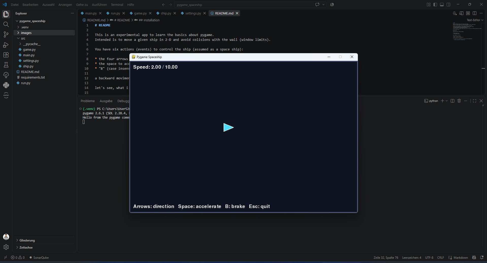

# Pygame Spaceship

<!-- open the .md file and press Shift+Ctrl+P; type > generate toc -->
<!-- vscode-markdown-toc -->
* [Intro](#Intro)
	* [Introduction for the initial version](#Introductionfortheinitialversion)
	* [State-of-the-Art](#State-of-the-Art)
* [Installation](#Installation)
	* [Virtual Environment](#VirtualEnvironment)
	* [Dependencies](#Dependencies)
	* [Executables](#Executables)
	* [Icons and Assets](#IconsandAssets)
* [Run the App](#RuntheApp)
* [First appearance](#Firstappearance)
* [IMPROVEMENTS](#IMPROVEMENTS)
	* [Game Experience](#GameExperience)
	* [Dynamic Functions](#DynamicFunctions)
	* [Design](#Design)
	* [Interaction](#Interaction)
* [Something about Git and Github](#SomethingaboutGitandGithub)
	* [1. initializing a local and remote repo](#initializingalocalandremoterepo)
	* [2. preparing it locally](#preparingitlocally)
	* [3. how to develop](#howtodevelop)
* [About the Author](#AbouttheAuthor)

<!-- vscode-markdown-toc-config
	numbering=false
	autoSave=false
	/vscode-markdown-toc-config -->
<!-- /vscode-markdown-toc -->


This is an experimental application for reviewing and remember the basics
of Pygame. The objective is to move a spaceship in two dimensions while 
avoiding collisions with the walls of the window.

## <a name='Intro'></a>Intro 

This app is developed originally with Win11, Python 3.13.3. Pygame 2.6.1

### <a name='Introductionfortheinitialversion'></a>Introduction for the initial version

The ship can be controlled using six actions:

- The four arrow keys change the ship's direction without inertia.
- The Space key accelerates the ship up to a defined speed limit.
- The `B` key applies the brake and reduces the ship's speed.

Negative velocity and backward movement are not implemented in this first
version.

### <a name='State-of-the-Art'></a>State-of-the-Art

We encourage you to explore the previous playable versions to see how the
project has evolved.

Let's see what I can build.

## <a name='Installation'></a>Installation

### <a name='VirtualEnvironment'></a>Virtual Environment

Create and activate a virtual environment:
```ps
python -m venv .venv
```

On WIndows:
```ps
.\.venv\Scripts\activate
```

On Mac or Linux:
```
source .venv/bin/activate
```

### <a name='Dependencies'></a>Dependencies

install the dependencies. Always when installing new dependencies, freeze it to requirements.txt:
```ps
python -m pip install pygame
python -m pip install pyinstaller
python -m pip freeze > requirements.txt
```

if you already have a requirements.txt, use this to install de dependencies:
```ps
python -m pip install -r requirements.txt
```

### <a name='Executables'></a>Executables

Pyinstaller is a library that allows you to create a windows executable file from python code. Ensure access to all configuration files and assets, so that different versions can run.

To create an executable version. For me, I needed to run it as a python module. Be Careful: PyInstaller is CamelCased. Under the simpliest command and some options I use:
```ps
python -m PyInstaller run.py
python -m PyInstaller --onefile --windowed --icon=<app.ico> --name <name> run.py 
```

HINT: An .exe file usually won't be added to git.

### <a name='IconsandAssets'></a>Icons and Assets

Required attribuition for the source.

Iconic Panda from Flaticon for spaceship.png 32x32px
```html
<a href="https://www.flaticon.com/free-icons/spaceship" title="spaceship icons">Spaceship icons created by Iconic Panda - Flaticon</a>
```

## <a name='RuntheApp'></a>Run the App

The file run.py simply repeats the main.py but it must stay on the project root to simplify the creation of executables.

```
python run.py
```


## <a name='Firstappearance'></a>First appearance

The first appearance of the ship also represents my first practical
experience with Pygame in a long time.



## <a name='IMPROVEMENTS'></a>IMPROVEMENTS

Collaboration is welcome. Pull requests are encouraged.

Use the following branch workflow:

* Create and test changes in the dev branch.
* Merge changes into the main branch when they are ready.

Feel free to implement the following topics in the way you consider most
appropriate.

### <a name='GameExperience'></a>Game Experience

    2026-08-25: at work. implemented game state and changing Game.draw()
    2026-08-27: done. implementation prepared for paused and gameover
    [X] Create a start screen with instructions and a start button.
        start btn replaced by "press enter"
        [ ] Optionally: one can additionally create a start btn
    [X] Remove the instructions from the game screen.

    [O] then create a screen for the state STATE_PAUSED
    [X] and a screen for the state GAME OVER. (done: 2026-09-02, )

    [ ] in the future, separate fixed app settings (remaining on settings.py)
        from user defined configuration (moved to a new file config.toml)

### <a name='DynamicFunctions'></a>Dynamic Functions

    [ ] Allow the ship to leave one side of the window and appear on the opposite side.
    [ ] Detect collisions with the window limit and trigger a game-over state.
        [ ] create some obstacles, so that the ship can navigate around .. or colide.
    [ ] Let the player choose between wrap-around and collision mode before the game starts.

    2026-08-25: both implements using the pygame.key.get_pressed()
    [X] Implement holding the Space key for continuous acceleration.
    [X] Implement holding the B key for continuous braking.

    [ ] Change the behavior of the left and right arrows to rotate the ship by 
        a defined number of degrees, allowing curved movement.

    [ ] Implement inertia:
        [ ] Use the Up arrow to accelerate.
        [ ] Use the Down arrow to brake or reduce velocity.
        [ ] Preserve the Space and B keys for their current functions.

    [ ] Improve the inertia system by allowing backward movement up to a defined speed limit.

### <a name='Design'></a>Design

    [ ] Replace the triangle with a spaceship icon. See: https://www.flaticon.com/free-icons/spaceship
    [ ] Create a starry background using Pygame.
    [ ] Add the Sun and Moon to the background.
    [ ] Make the celestial bodies move slowly.
    [ ] Add comets and stars that move faster across the background.

### <a name='Interaction'></a>Interaction

    [ ] Add shooting functionality:
        [ ] Replace the current Space key function with normal firing.
        [ ] Use the B key to throw bombs.

    [ ] Add a timer for bombs and display an animation after a few seconds.

    [ ] Add asteroids that can hit the ship and be hit by shots or bombs:
        [ ] Add hit points for the ship.
        [ ] Add hit points for the asteroids.

    [ ] Add an explosion animation when the ship is destroyed.

---

## <a name='SomethingaboutGitandGithub'></a>Something about Git and Github

My way: how do I do it for myself

### <a name='initializingalocalandremoterepo'></a>1. initializing a local and remote repo

* Independently from each other:
  * create a local folder (on pc) and 
  * remote repository (on github). Normally I set: is Public, has README, has gitignore (for Python), License MIT.

### <a name='preparingitlocally'></a>2. preparing it locally

1. Here you need to create your folder structure, and the first state to commit. It becomes normaly a runnable and free of errors version but nothing so special is needed.
2. Then do the basics: git init; define user and email; set branch as main; add and check remote; add .; commit -m "initial"
3. after your first local commit, you can pull origin and edit the .gitignore

**Commands to Nr 2**: 

some basic commands, for reference if necessary:
```console
git init
git config [None|--global|--local] user.name <your git name>
git config [None|--global|--local] user.email <your git email>
git branch -M main
git remote add origin <your_github_url_if_working_with_https>
git remote -v
git add .
git commit -m "initial"
```

HINTS:  
define branch main as default for git configuration
```console
git config --global init.defaultBranch main
```

ALTERNATIVELY:  
rename master (lower -m):
```
git branch -m master main
```

delete the master branch from server, if necessary
```
git push origin --delete master
```

**Commands and Hints to Nr. 3**:

to pull, allow unrelated histories and resolve conflicts
```console
git pull origin main --allow-unrelated-histories
```

at .gitignore I use currently the following standard:
* .gitignore Python from Github
* comment dist/ to allow push of executables from pyinstaller
* uncomment .vscode/ to avoid this commit and push

 * * * HINT * * *:  
The folder .git will be ignored by default and shouldn't be included 

Then add, commit and push. The game begins here!

### <a name='howtodevelop'></a>3. how to develop

Up to now I normally work on small private projects, then I siply commit everything on the main, but from now I want to become more professional and separate the branches, starting with two: main and dev.

The workflow:

1. Ensure you are on main and main is up-to-date. main must be my entry point. Then change to dev and create a new dev locally. after that push it to the server. The server must know, you have a new branch dev.  
The -c option on ```git switch -c dev``` creates the branch and switches to it.
2. working on this new dev (LOOP IT), up to a runnable, good for merge version be reached. more commits here are possible / wanted.
3. switch to main, ensure main is locally up-to-date, merge dev to main (you must to be there, on main), and push it to server. the lines come together!
4. repeat, this time without ```-c``` and without ```push origin dev```, and go back to Nr 2.

I'll follow the steps under:
```ps
# 1. Create dev the first time
git switch main
git pull origin main
git switch -c dev
git push -u origin dev

# 2. Develop (LOOP IT)
git add .
git commit -m "Describe the change"
git push origin dev

# 3. Merge finished work into main / change the message if necessary
git switch main
git pull origin main
git merge dev --no-ff -m "merge dev into main"
git push origin main

# 4. Start the next development cycle and go back to Nr. 2
git switch dev
```

Alternatively:
```ps
# change branch to dev
git checkout dev

# chance branch to main
git checkout main
```

check on which branch you currently are
```
git branch
# should return branch names. the asterisc shows where you are
#   dev
# * main
```

### 4. checking git log in a nut shell

```
git log --oneline --graph --decorate --all
```

The options mean:

* --oneline — one compact line per commit
* --graph — shows branch structure using *, |, and /
* --decorate — shows branch and tag names
* --all — includes all local branches, not only the current branch

---

## <a name='AbouttheAuthor'></a>About the Author

Cicero Lima is a M.Sc. in Mechanical Engineering, PCAP-certified Python developer,
and father of three children. He has eight years of professional
experience as a software developer in Germany and is currently attending
a German FIAE training program with the goal of becoming an IHK-certified
IT professional.

His interest in programming and games goes back to the 1980s, when
space-invasion games, pinball machines, and arcade cabinets sparked his
curiosity about computers and interactive entertainment. Those early
experiences made games a natural and enjoyable way to explore programming.
Making also his mother sometimes crazy.

This project is motivated by a desire to revisit the fundamentals of
Pygame and strengthen his understanding of game loops, events, movement,
collisions, and rendering. It is an experimental project created for
learning and practice.

Cicero is passionate about challenging projects, especially in IT
security and algorithmic trading. He enjoys learning by building
practical applications and exploring how software works from the ground
up.
